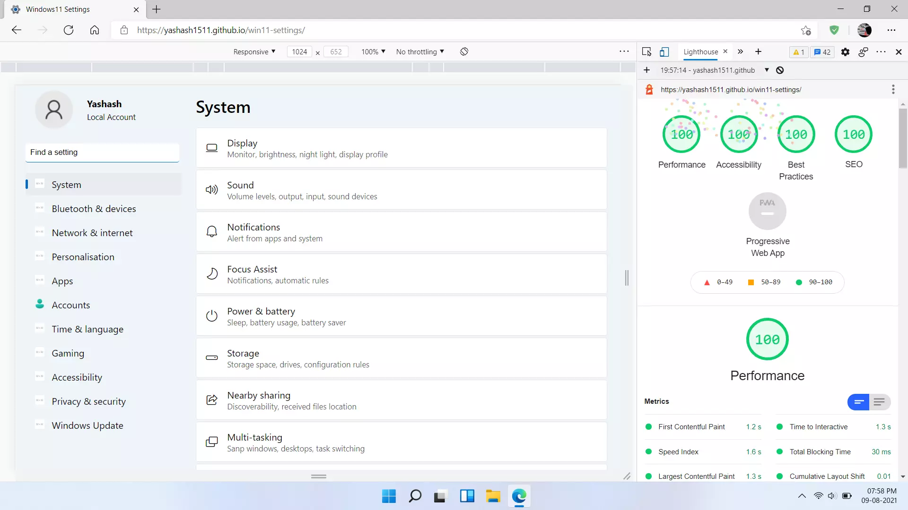
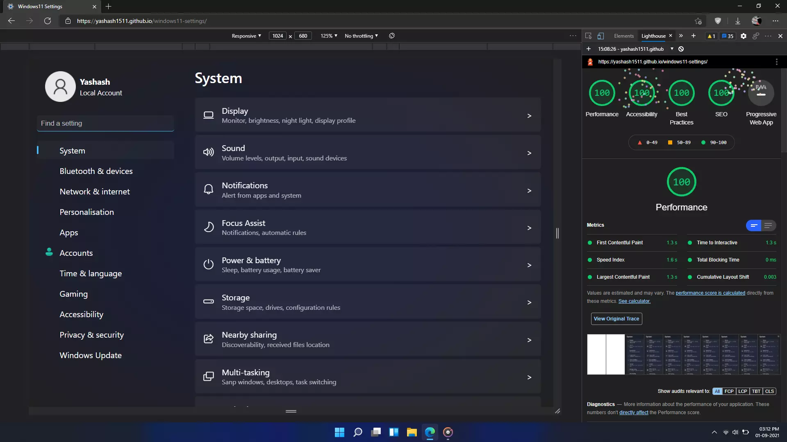

# Windows 11 Settings in React

## Have a look at [win11-settings.netlify.app](https://win11-settings.netlify.app/) or below :smile:

| Demo image (light mode)             | Demo image (dark mode)                        |
| ----------------------------------- | --------------------------------------------- |
|  |  |

Fun Fact : It has a Lighthouse score of 100

## FAQ

- Can I contribute?
  - Yeah sure why not! Just open an issue, create a pull request

## TODO list

- [x] animation in side nav bar
- [x] Dark mode
- [x] responsiveness
- [ ] icons on every page (I need help with this)
